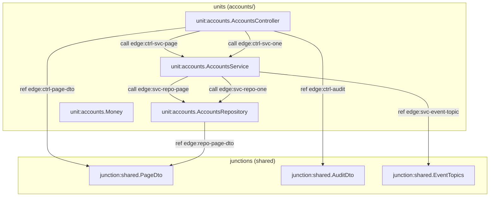
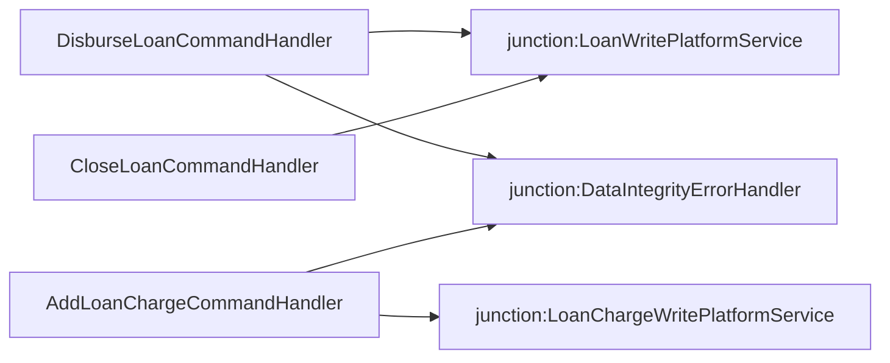

# Graph-level views — what exists today

**Short answer:** **Partial.** The repo stores **graph-shaped data** (WiringMap v0 JSON, E1 witness refs, E3/E5 handler graphs) and ships **ASCII / static HTML** views for the E1 toybank. There is **no** checked-in WiringMap → SVG/Mermaid/Graphviz renderer and **no** `make` target that emits diagram files from v0 JSON.

**Meeting companion:** live harness script on branch `cursor/demo-showcase-cd12` (`docs/DEMO-SHOWCASE.md`, not yet on `main`). This page is the **graph inventory** and a factual WiringMap slice in Mermaid.

---

## 1. What you can open or run today

| View | Type | Path / command | Notes |
|------|------|----------------|-------|
| E1 witness instrument | Static HTML (ASCII in `<pre>`) | [`docs/witness/index.html`](witness/index.html) | Open in browser (file:// or GitHub raw). Pipeline + **toybank module graph** + pushout ASCII. |
| E1 witness source | Markdown (ASCII) | [`docs/witness/WITNESS-HOW-IT-WORKS.md`](witness/WITNESS-HOW-IT-WORKS.md) | Same diagrams as HTML; 13-check table. |
| E1 artifact | JSON (checks + witness blobs) | `witness/WITNESS.json` | Regenerate: `make witness` or `python3 witness/run_witness.py`. |
| Programme scale ladder | Markdown (ASCII) | [`docs/SCALE-PATH.md`](SCALE-PATH.md) | Vision flow: repo → WiringMap v1 → L1/L2/L3. |
| WiringMap schema shape | Markdown (ASCII) | [`wiringmap/README.md`](../wiringmap/README.md) | Instance layout (units, junctions, edges). |
| L1 navigation (tables, not drawn) | Markdown | [`docs/dogfood/L1-toybank-accounts.md`](dogfood/L1-toybank-accounts.md), [`L1-fineract-handlers-thin.md`](dogfood/L1-fineract-handlers-thin.md) | Port/edge tables mirroring v0 JSON. |
| Dashboard (programme, not wiring) | Static HTML | [`dashboard/index.html`](../dashboard/index.html) | E2/E3 narrative; not a repo graph UI. |
| E3 handler extract | JSON graph | [`experiments/e3-ablation/graph.json`](../experiments/e3-ablation/graph.json) | 30 handlers: `deps`, `edges`; build via `experiments/e3-ablation/e3_build.py` (not in default `make verify`). |
| E5 merged wiring | JSON graph | [`experiments/e5-depth/graph.json`](../experiments/e5-depth/graph.json) | Handlers + services; `e5_build.py`. |

**Regenerate the main *faithfulness* diagram narrative (not WiringMap):**

```bash
make witness
# rewrites witness/toybank/*.java and witness/WITNESS.json; refresh browser on docs/witness/index.html
```

**Regenerate graph-shaped *pipeline* data (JSON only, temp extract paths in report):**

```bash
make pipeline-io
# validates + extract ↔ wiringmap ↔ L2 pack ↔ re-expand; prints JSON to stdout
```

**Validate / stress WiringMap v0 (no diagram output):**

```bash
make wiringmap-check    # schema + toybank extract gate
make wiringmap-stress   # density D0–D4 + fineract-thin D4
python3 scripts/extract_refs.py witness/toybank/accounts \
  --example wiringmap/examples/toybank-accounts.v0.json
```

---

## 2. WiringMap v0 — machine graph, human ASCII only

Canonical toy slice (4 units, 3 junctions, 8 edges):

- [`wiringmap/examples/toybank-accounts.v0.json`](../wiringmap/examples/toybank-accounts.v0.json)
- Siblings: [`toybank-loans.v0.json`](../wiringmap/examples/toybank-loans.v0.json), [`toybank-savings.v0.json`](../wiringmap/examples/toybank-savings.v0.json)

Thin real slice (7 Java files, partial map):

- [`fixtures/external/fineract-handlers-thin/wiringmap.v0.json`](../fixtures/external/fineract-handlers-thin/wiringmap.v0.json)

L2 pack emits **text** edges (`edge …` lines in `*.pack/pack_explicit.txt`), not graphics — see `make pipeline-io` / `scripts/build_l2_pack.py`.

---

## 3. Mermaid — toybank `accounts/` slice (from v0 JSON)

Nodes and edges below match [`toybank-accounts.v0.json`](../wiringmap/examples/toybank-accounts.v0.json) (`edge_kind`, endpoints, evidence). Junction IDs are shortened for readability.



`unit:accounts.Money` is catalogued in the map (κ demo lives in full witness verticals); **no edges** in this accounts-only slice.

Full 16-file **module** graph (accounts ‖ savings ‖ loans ‖ report) is ASCII in [`WITNESS-HOW-IT-WORKS.md`](witness/WITNESS-HOW-IT-WORKS.md) § “Toybank module graph”, not auto-synced from WiringMap v0.

---

## 4. Fineract thin slice (sketch)

Three wired handlers → platform junctions (5 ref tokens gated by `extract_refs`):



Source: [`fixtures/external/fineract-handlers-thin/wiringmap.v0.json`](../fixtures/external/fineract-handlers-thin/wiringmap.v0.json).

---

## 5. Gap — compelling graph UI

| Missing | Why it matters |
|---------|----------------|
| **WiringMap v0 → diagram emitter** | JSON is the graph; meetings need one command → SVG/Mermaid/HTML. |
| **Live sync** | Witness toybank ASCII, WiringMap JSON, and L1 markdown are **curated separately** (gates align extract ↔ map, not layout). |
| **Scale view** | No repo-wide or handler-family graph UI; E3/E5 `graph.json` has no renderer in-tree. |
| **Interactive explorer** | No zoom/filter on ports, edge kinds, or orbit boundaries (symmetry-lens is prose + fixtures). |

Reasonable next step: read-only `scripts/wiringmap_to_mermaid.py` (or Graphviz) invoked from `make wiringmap-check`, writing to `docs/graphs/` — **not shipped yet**.

---

## 6. Historical note

Branch `cursor/witness-diagrams-cd12` landed E1 ASCII + HTML (`docs/witness/*`); it did **not** add WiringMap renderers. Repo policy ([`HANDOFF.md`](../HANDOFF.md)): prefer ASCII in docs unless Mermaid is explicitly requested — this page is the exception for stakeholder graph literacy.
