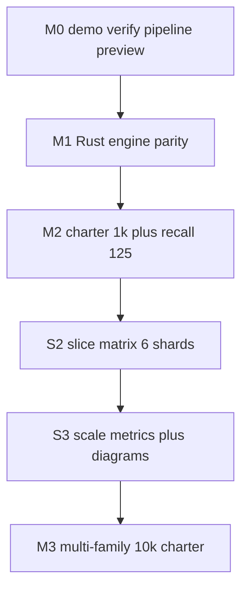
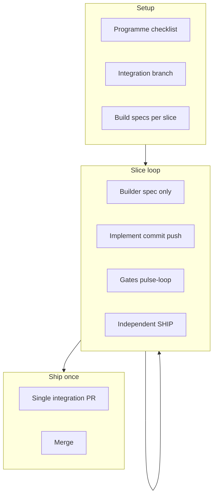
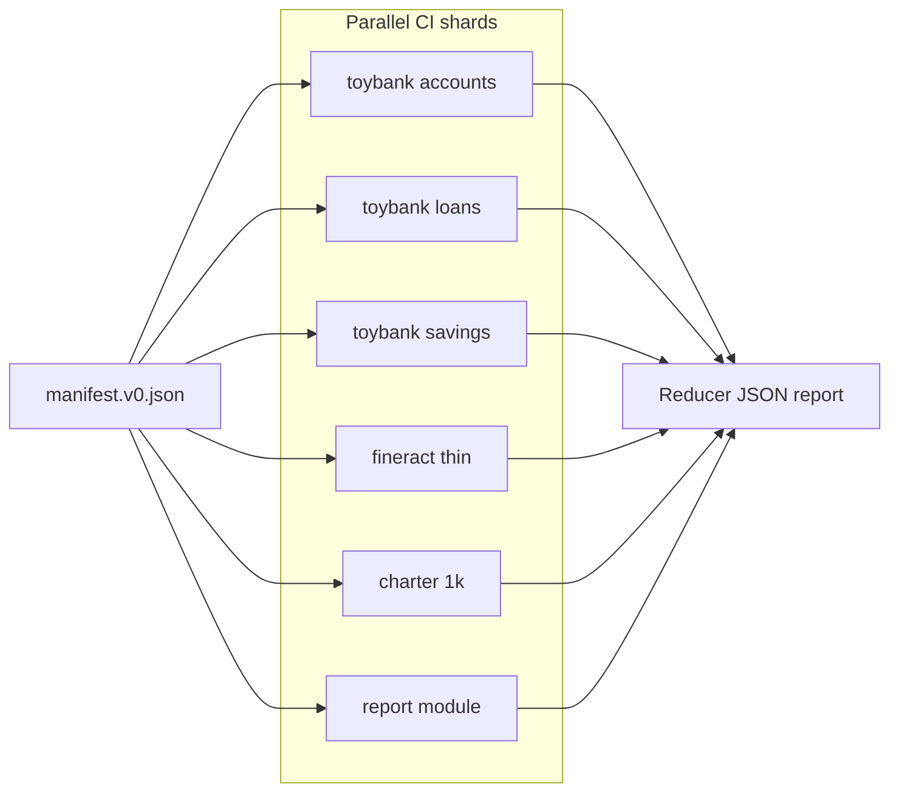
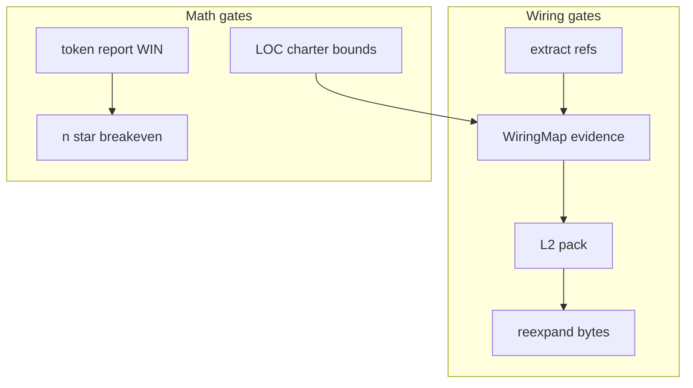
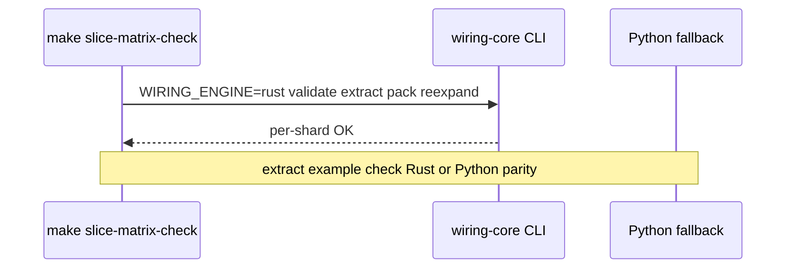

# Scale & compound diagrams

**Preview (live render):** [wiring-graph-preview.vercel.app/scale](https://wiring-graph-preview.vercel.app/scale) — requires **`/scale` on `main`** (Scale Build S2+S3); until deploy finishes, read the Mermaid blocks below in GitHub.

**Source of truth for chart text:** [`preview/graph/src/lib/scaleDiagrams.ts`](../preview/graph/src/lib/scaleDiagrams.ts) · **Skill DAGs:** [`skills/compound-build-loop/SKILL.md`](../skills/compound-build-loop/SKILL.md).

---

## Scale ladder

---

## Compound build programme

---

## Slice matrix (shard-local pipeline)

**Command:** `make slice-matrix-check` · **Manifest:** [`fixtures/slice-matrix/manifest.v0.json`](../fixtures/slice-matrix/manifest.v0.json).

---

## Wiring + math honesty

**Commands:** `make wiring-core-check` · `make scale-metrics-check` · `make edge-recall-sample-check`.

---

## Rust pipeline (per shard)

