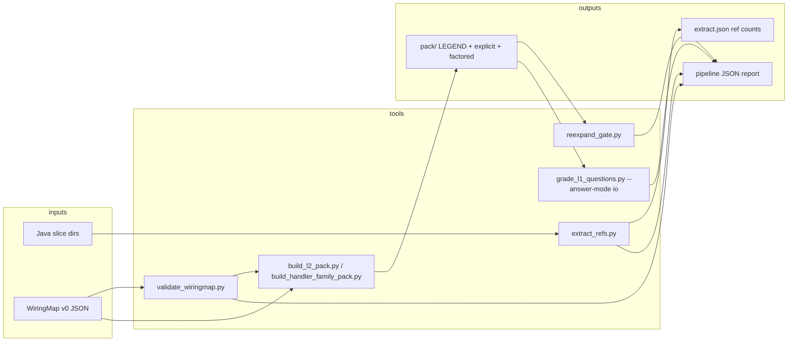

# Vision and real capabilities — progress report (2026-10-02)

**Audience:** technical leadership · **Repo:** `manutej/wiring-and-the-whole` · **Branch baseline:** `origin/main` at report date.

**Related cold-start docs:** [`docs/CONTEXT-COMPACT.md`](../CONTEXT-COMPACT.md), [`docs/SCALE-PATH.md`](../SCALE-PATH.md), [`HANDOFF.md`](../../HANDOFF.md).

---

## Vision in one paragraph

The programme treats a large codebase as a **module of systems**: compilation units expose **ports** (interfaces), and **typed edges** describe how units interact. If that structure is real, an agent should navigate and reason from a **wiring projection** (L1) and **factored pattern packs** (L2) instead of raw file dumps—without paying a comprehension tax at matched fidelity. Success at scale is pre-registered in [`plans/ADVERSARIAL.md`](../../plans/ADVERSARIAL.md): **CR@F95** (tokens to reach ≥95% of full-context accuracy, headline = marginal gain of L2–L4 over L1), **edge recall** on staff-engineer slices, and **E3-style comprehension** (B arm within ≤5 pts of A). **Demonstrated on toy and wedge fixtures ≠ proved on Fineract-scale trees.** The honest ladder is: toy harness → one real motif family (Fineract `@CommandType` handlers) → sparse path-list fetch and map statistics—documented in [`docs/SCALE-PATH.md`](../SCALE-PATH.md).

---

## Terminology: what “maps” means here

| Term | Meaning in-repo | Primary artifacts |
|------|-----------------|-------------------|
| **WiringMap v0** | JSON **interface catalog**: `units`, `ports`, `edges`, optional `junctions` | [`wiringmap/schema.v0.json`](../../wiringmap/schema.v0.json), examples under [`wiringmap/examples/`](../../wiringmap/examples/) |
| **Map (hand-curated today)** | Human-maintained v0 JSON aligned to a **slice** of Java | e.g. [`wiringmap/examples/toybank-accounts.v0.json`](../../wiringmap/examples/toybank-accounts.v0.json), [`fixtures/external/fineract-handlers-thin/wiringmap.v0.json`](../../fixtures/external/fineract-handlers-thin/wiringmap.v0.json) |
| **Extract (automated today)** | Scan Java for `// refs:` comment lines; cross-check against map **evidence** fields | [`scripts/extract_refs.py`](../../scripts/extract_refs.py) |
| **L2 pack** | Token-oriented **factored wiring** (`LEGEND`, explicit graph, motif + inst rows) built from a map or parser | [`scripts/build_l2_pack.py`](../../scripts/build_l2_pack.py), [`scripts/build_handler_family_pack.py`](../../scripts/build_handler_family_pack.py) |
| **Parse graph (handler wedge)** | Regex/sidecar parse of `@CommandType` handlers → `CommandHandler` motif rows | [`scripts/command_handler_parse.py`](../../scripts/command_handler_parse.py) |

There is **no** repo-wide static analyzer that emits WiringMap v0 from arbitrary Java yet. [`wiringmap/README.md`](../../wiringmap/README.md) states examples are hand-curated; extractors cover **`// refs:`** and the **CommandHandler** family parser only.

---

## What we can run today — maps pipeline

### End-to-end operator flow



**Canonical world I/O (CI-shaped):** `make pipeline-io` → [`scripts/pipeline_world_io.sh`](../../scripts/pipeline_world_io.sh)

| Step | Command / script | Input | Output |
|------|------------------|-------|--------|
| Ref extract | `python3 scripts/extract_refs.py <dir> --example <map.json>` | Java tree with optional `// refs:` | stdout JSON: `refs_by_file`, `ref_token_count`; exit **1** if map evidence misses a ref |
| Schema gate | `python3 scripts/validate_wiringmap.py <schema> <instance>` | `wiringmap.v0` instance | exit 0/1 |
| L2 from map | `python3 scripts/build_l2_pack.py <map.json>` | toybank-style map | `<map>.pack/` directory |
| Faithfulness | `python3 scripts/reexpand_gate.py <pack-dir>` | pack on disk | exit 0 iff factored re-expansion **byte-matches** explicit |
| L1 navigation test | `grade_l1_questions.py --answer-mode io` | L1 markdown pack + frozen questions | pass/fail vs expected answers (parsed from pack tables, not LLM) |
| Full round-trip | `make pipeline-io` | toybank accounts + fineract-thin fixture | machine-readable JSON report (ref counts, pack paths, fetch I/O check) |

**Stress / density ladder (adversarial fixtures, no production tree):** `make wiringmap-stress` — manifest [`fixtures/density/stress_manifest.json`](../../fixtures/density/stress_manifest.json) defines **D0–D4**: witness toybank (pass), missing ref (extract fail), invalid schema (validate fail), MVC orbit (pass), external thin slice (pass). See [`fixtures/density/README.md`](../../fixtures/density/README.md).

**WiringMap-only check:** `make wiringmap-check` — validate examples + toybank extract helper [`scripts/extract_toybank_refs.py`](../../scripts/extract_toybank_refs.py).

**External thin slice (Wedge 2 pin):** `make external-slice-check` → [`scripts/fineract_slice_check.sh`](../../scripts/fineract_slice_check.sh): ≥5 Java handlers, wiringmap validate, extract coverage, **MANIFEST drift** via [`scripts/validate_slice_manifest.py`](../../scripts/validate_slice_manifest.py). Fixture: seven vendored handlers — [`fixtures/external/fineract-handlers-thin/README.md`](../../fixtures/external/fineract-handlers-thin/README.md) (not a live Fineract checkout).

**Sparse fetch staging (no full tree):** `make fetch-slice-dry-run` / `fetch-slice-io-check` → [`scripts/fetch_fineract_slice.sh`](../../scripts/fetch_fineract_slice.sh) (dry-run by default; `--apply` refreshes slice + `MANIFEST.txt`; local corpus fallback from `experiments/e3-ablation/raw`).

---

## Element extraction — what is extracted, accuracy, limits

### 1. `// refs:` extraction (primary map element)

- **Mechanism:** [`scripts/extract_refs.py`](../../scripts/extract_refs.py) regex `// refs: token token ...` per `.java` file.
- **Ground truth for maps:** each `ref` edge in WiringMap v0 should cite evidence containing the same file + token pair ([`wiringmap/README.md`](../../wiringmap/README.md)).
- **Coverage today:**
  - **Toybank witness** (`witness/toybank/accounts|loans|savings/`): hand maps in [`wiringmap/examples/`](../../wiringmap/examples/) — used in E1 (13/13) and density D0/D3.
  - **Fineract thin:** only **three of seven** handlers carry hand-maintained `// refs:`; others counted via import-line fallback in slice check only — **not** fully wired in `wiringmap.v0.json` ([`fixtures/external/fineract-handlers-thin/README.md`](../../fixtures/external/fineract-handlers-thin/README.md)).
- **Edge recall gate:** `make edge-recall-sample-check` — **29 frozen** `(file, ref token)` pairs across toybank MVC slices + thin slice ([`fixtures/edge-recall-sample/README.md`](../../fixtures/edge-recall-sample/README.md)). This is **extract ↔ map evidence** agreement on a sample, not staff-audited recall on 514 handlers.

### 2. CommandHandler family parse (L2 wedge, not WiringMap JSON)

- **Mechanism:** [`scripts/command_handler_parse.py`](../../scripts/command_handler_parse.py) + [`scripts/build_handler_family_pack.py`](../../scripts/build_handler_family_pack.py).
- **Input path list:** `experiments/e3-ablation/raw/*CommandHandler.java` (30 files vendored from E3 corpus).
- **Output:** [`fixtures/e3-commandhandler-wedge/pack/`](../../fixtures/e3-commandhandler-wedge/pack/) — same E2 layout as Fineract S3 (`CommandHandler` motif from [`experiments/e2-tokens/pack_S3_motif.txt`](../../experiments/e2-tokens/pack_S3_motif.txt)).
- **Scorecard:** **29/30 parsed** into pack; **1 skipped** — `PaymentTypeCreateCommandHandler` (orthogonal `CommandHandler<Req,Res>` API, not `@CommandType` family) per [`fixtures/e3-commandhandler-wedge/manifest.json`](../../fixtures/e3-commandhandler-wedge/manifest.json).
- **Sidecar:** [`fixtures/e3-commandhandler-wedge/annotation_sidecar.v0.json`](../../fixtures/e3-commandhandler-wedge/annotation_sidecar.v0.json) — **1 handler** needs manual `@CommandType` entity/action when source uses constants the regex does not resolve.
- **Proof:** `make handler-family-pack-check` — build, **reexpand byte gate**, assert `parsed >= 29`, refresh [`token_report.json`](../../fixtures/e3-commandhandler-wedge/token_report.json).
- **Not claimed:** 514-handler repo-wide family, Spring DI/reflection wiring, or automatic WiringMap emission from parse output.

### 3. L1 “elements” for agents (navigation packs)

- **Emitters:** L1 markdown under [`docs/dogfood/`](../../docs/dogfood/) (meta, toybank, fineract-thin, handler-wedge).
- **Grading:** [`scripts/grade_l1_questions.py`](../../scripts/grade_l1_questions.py) — **`--answer-mode io`** parses pack tables (grading facts / catalog rows); heuristic mode for some fixtures.
- **Skills (3/3):** [`skills/interface-first-context/SKILL.md`](../../skills/interface-first-context/SKILL.md), [`skills/systems-intake/SKILL.md`](../../skills/systems-intake/SKILL.md), [`skills/symmetry-lens/SKILL.md`](../../skills/symmetry-lens/SKILL.md) — instruments for human/agent workflow; proof is dogfood gates, not field deployment metrics.

---

## Quality loop (pulse) and gates

**Pulse** = implement → adversarial panel → merge gate → interface tests → firewalled evaluator ([`docs/PULSE.md`](../PULSE.md)). On `main`, automation emphasizes **functional** gates over frozen-json echo.

| Gate | Command | What it proves |
|------|---------|----------------|
| Core repro | `make verify` | E1 witness 13/13; E2 token math vs frozen [`E2-RESULTS.json`](../../experiments/e2-tokens/E2-RESULTS.json); E3 grades vs frozen [`E3-GRADES.json`](../../experiments/e3-ablation/E3-GRADES.json) |
| Functional battery | `make pulse-eval` | **34** checks ([`scripts/pulse_eval_functional.sh`](../../scripts/pulse_eval_functional.sh)): tampered pack/reexpand failures, density matrix, pipeline I/O, handler wedge, MANIFEST drift, CR@F95 stub, pack-blind eval, unified eval JSON, edge-recall negatives, firewall leaks, **meta-evaluator hook** ([`make meta-evaluator-check`](../../Makefile)) |
| Reminder script | `make pulse-gate` | Operator checklist ([`scripts/pulse_gate.sh`](../../scripts/pulse_gate.sh)) |
| Loop doc | `make pulse-loop` | verify + pulse-eval + role checklist ([`docs/pulse/LOOP-ENGINEERING.md`](../pulse/LOOP-ENGINEERING.md)) |

**Eval harness stubs (no default LLM):**

- **Pack-blind:** [`experiments/pack-blind-eval/`](../../experiments/pack-blind-eval/) — prompt bundles without answers; optional `PACK_EVAL_LLM=1` ([`Makefile`](../../Makefile) `pack-blind-eval-check`).
- **CR@F95 stub:** [`experiments/cr-f95-stub/`](../../experiments/cr-f95-stub/) — token budget + question firewall; **`accuracy_column: null`** enforced ([`scripts/cr_f95_stub_run.py`](../../scripts/cr_f95_stub_run.py)).
- **Unified report:** [`experiments/pulse-unified-eval/`](../../experiments/pulse-unified-eval/) — one JSON combining pack-blind + CR@F95 stub; `llm_invoked: false` by default in pulse-eval.

**Frozen empirical claims (historical, still gated on verify):** E2 WIN on three Fineract sites; E3 pilot B passes at ~63% tokens of A; E5 depth parity after harness fixes — summaries in [`README.md`](../../README.md) and [`HANDOFF.md`](../../HANDOFF.md).

---

## What we cannot yet claim

1. **Repo-scale WiringMap v1** from sparse path-list fetch over live Fineract — thin slice is seven vendored files; maps are partial and hand-curated.
2. **Full `@CommandType` family (514)** — wedge covers **29/30** files in the E3 raw pool only; one orthogonal handler class explicitly out of scope.
3. **CR@F95 benchmark** — harness records tokens and firewall; **no live LLM accuracy column** on default CI (`accuracy_column: null`).
4. **GA6/GA7 at meso scale** — no 50+10 E3 on wedge packs; frozen E3 is pilot-scale, different corpus.
5. **Spring DI / reflection wiring** — explicitly deferred ([`docs/SCALE-PATH.md`](../SCALE-PATH.md), GA2).
6. **Doctrine tags as guarantees** — v0 naming convention only (GA10).
7. **Paris / Every research corpus on `main`** — lives on feature branches per [`docs/pulse/LOOP-ENGINEERING.md`](../pulse/LOOP-ENGINEERING.md); not in `make verify`.
8. **Meta-evaluator scope** — post-loop handoff bundle ([`scripts/meta_evaluator_hook.py`](../../scripts/meta_evaluator_hook.py)) lists optional **craft** skills when `craft/` or `CRAFT_SKILLS_ROOT` resolves; it is **not** a programme scorer and does not replace firewalled rubric eval ([`docs/pulse/reports/2026-10-02-pulse-meta-evaluator.md`](../pulse/reports/2026-10-02-pulse-meta-evaluator.md)).

---

## Recommended next three milestones

1. **Live LLM lane for unified eval** — Fill `accuracy_column` under firewall; Pareto curve vs L1/full-context baselines on handler-wedge + meta L1; keep default CI LLM-off, optional job with `PACK_EVAL_LLM=1` + pinned models ([`docs/SCALE-PATH.md`](../SCALE-PATH.md) item 6).

2. **Wedge 2 vertical slice** — Expand `fixtures/external/fineract-handlers-thin` (or successor) with `fetch_fineract_slice.sh --apply` + upstream pin; grow **edge-recall-sample** beyond 29 pairs; target partial WiringMap coverage with extract gate, not import fallback alone.

3. **Parser v1.1 → map bridge** — Emit WiringMap `ref`/`call` edges from CommandHandler parse (or next family) where `@CommandType` + injection pattern is unambiguous; sidecar only for constant-resolution gaps; re-run handler-family-pack-check + new map validate before claiming wider Fineract density.

---

## Quick reference — scale-path alignment

```
  TOY (D0–D3)     WEDGE 1 (29/30)      WEDGE 2 (thin slice)     SCALE (open)
  ───────────     ───────────────      ────────────────────     ────────────
  witness/        e3-ablation raw      7 Java + MANIFEST        CR@F95 + mixed
  toybank maps    CommandHandler L2    extract + partial map    sites + orbit stats
  make verify     handler-family-      external-slice-check     (not shipped)
                  pack-check
```

**Honest position:** The harness **proves** faithful L2 factoring and L1 I/O grading on fixed fixtures, **demonstrates** real Fineract handler syntax at 29-file density, and **pins** external-slice discipline. It does **not** yet prove the programme thesis on production-scale wiring extraction or matched-fidelity token Pareto against live models.
