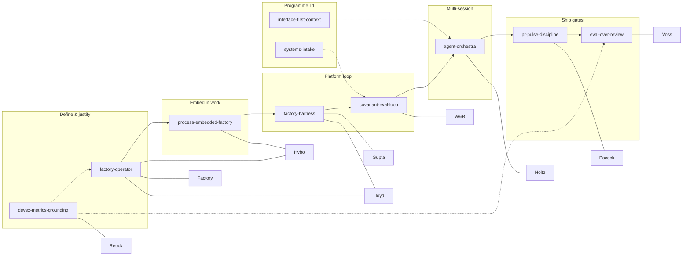

# Software factory skill / plugin package — implementable spec v0

**Status:** candidate · **Corpus:** 9 ingested Paris 2026 talks (`research/ai-engineer-paris-2026/digest.json`) · **Package root:** `skills/paris-level-up/`

## Purpose

Ship a **Cursor-compatible skill bundle** (repo skills today; optional `plugin-manifest.json` tomorrow) that encodes a coherent **software factory operating system** for long-running agents and team coding factories — with **progressive disclosure** so operators can act on Layer 1–2 while auditors drill to Layer 3 transcript cites.

## Caption limitation (read once)

All ingested talks use **English (auto-generated) YouTube captions**. Timestamps and quoted snippets are **best-effort alignments** to those captions, not manual transcripts. Where digest/editorial bullets exist, prefer them over paraphrase. Claims not present in ingested JSON are **pending ingest** or **CONJECTURE** (editorial synthesis).

## Package architecture

```text
skills/paris-level-up/
├── README.md                 # Curriculum + unified OS map
├── plugin-manifest.json      # stub: name, skills[], triggers[] (optional)
└── (skills live as siblings)
    factory-operator/
    process-embedded-factory/
    factory-harness/
    covariant-eval-loop/
    agent-orchestra/
    pr-pulse-discipline/
    eval-over-review/
    devex-metrics-grounding/

Programme boundary (T1 — not in Paris bundle):
    interface-first-context/
    systems-intake/
    symmetry-lens/
```

### Install / discovery model (repo skills)

| Mode | Behavior |
|------|----------|
| **Repo skill** | Agent reads `SKILL.md` when `description` frontmatter matches user task (Cursor skill discovery). |
| **Curriculum** | Human or meta-agent loads `paris-level-up/README.md` order for greenfield factory design. |
| **Registry** | `docs/research-insights/paris-2026.yaml` maps `video_id` → skill path; CI via `make verify-research`. |
| **Future plugin** | `plugin-manifest.json` lists skill paths + trigger phrases for packaged install. |

### Trigger model

Each skill `description` field holds **auto-apply phrases** (factory, harness, PR bottleneck, covariant eval, orchestra, DevEx, etc.). Plugin stub duplicates high-value triggers for marketplace packaging.

**Composition trigger:** user mentions “coding factory”, “long-running agents”, “software factory OS” → load `factory-operator` then follow README pipeline.

## Progressive disclosure schema

Every Paris factory skill MUST include these sections (see updated `SKILL.md` files):

### Layer 1 — One-liner

Single sentence operable definition; no new claims beyond existing Core moves.

### Layer 2 — Moves

3–7 bullet **moves** (may mirror “Core moves” titles); imperative verbs; no transcript quotes.

### Layer 3 — Transcript refs

Markdown table:

| `video_id` | MM:SS | Label | Snippet / quote |
|------------|-------|-------|-----------------|
| … | … | FACT / CONJECTURE | ≤120 chars from digest, `transcript-summaries.json`, or caption hook |

**Rules:**

- **FACT:** snippet appears in `digest.json` bullets, `transcript-summaries.json` quotes/opening, or charter-committed editorial stub with same `video_id`.
- **CONJECTURE:** synthesis (e.g. explorer thesis, cross-talk pairing) — must be labeled; never scored as FACT in evaluator pass.
- **Pending ingest:** catalog-only videos — not used in v0 skills.

### Unified system

Short subsection: **position in factory OS**, **upstream/downstream skills**, **primary talk(s)**. One talk minimum per skill; some talks split across skills by design (WorkOS → operator + embed; Warp → harness + operator cite).

## Unified factory OS (long-running agents)



### Talk coverage matrix (9 ingested)

| video_id | Speaker | Primary skill(s) | Role in OS |
|----------|---------|------------------|------------|
| `HvboD89DyQ8` | Cooke, WorkOS | factory-operator, process-embedded-factory | Skeptic definition + embed |
| `vGCJ7diEtrw` | Tížková, Factory | factory-operator | Builder economics / build-buy |
| `tUPPVhBBcoM` | Lloyd, Warp | factory-harness, factory-operator | Environment-centric factory |
| `TN3mj92oZ8I` | Gupta, Warp | factory-harness | Harness + refresh + routing |
| `XyV6bSMyq-I` | Aysola, W&B | covariant-eval-loop | Covariant eval flywheel |
| `TRfzFJCJ7ZE` | Holtz, Conductor | agent-orchestra | Parallel coordination |
| `LlgiOCmFG_w` | Pocock, AIHero | pr-pulse-discipline | PR/pulse brakes |
| `_mi3alkqy4s` | Voss, Arize | eval-over-review | Eval over ritual review |
| `Se8jHLliLXE` | Reock, DX | devex-metrics-grounding | Org measurement |

## Multi-agent consensus (this spec)

Three iterations documented under `docs/specs/software-factory-skills-consensus/`. Roles:

1. **Advocate** — proposes unified OS + skill sections.
2. **Faithfulness evaluator** — reads **only** `digest.json`, `transcript-summaries.json`, `catalog.json` (no advocate prose); scorecard per talk/skill.
3. **Operator synthesizer** — merges evaluator deltas into next iteration.

Final skill set is iteration-3 output.

## Implementation phases

| Phase | Deliverable | Acceptance |
|-------|-------------|------------|
| **P0** | This spec + consensus artifacts | 3 iterations on disk |
| **P1** | 8 `SKILL.md` + README progressive disclosure | Each skill ≤~150 lines; Layer 3 table present |
| **P2** | `plugin-manifest.json` stub | Valid JSON; skills[] matches paths |
| **P3** | Registry row for spec | `paris-2026.yaml` target |
| **P4** | CI | `make verify` + `make verify-research` PASS |

## Acceptance tests — faithfulness

Automatable / manual checks for reviewers:

1. **Coverage:** Every id in `digest.json` → `transcripts_ingested` appears in ≥1 skill Layer 3 table.
2. **No orphan skills:** Each skill lists ≥1 ingested `video_id` in Layer 3.
3. **FACT audit:** Spot-check 3 FACT rows per skill against `transcript-summaries.json` or digest bullets; mismatches → fail.
4. **CONJECTURE hygiene:** Any cross-talk synthesis (e.g. “pairs with Pocock”) labeled CONJECTURE in Layer 3 or spec.
5. **Caption banner:** README or spec states auto-caption limitation once (this doc § Caption limitation).
6. **Pending ingest:** Catalog videos not in `transcripts_ingested` must not appear as FACT (e.g. Antigravity `buHC7bQE1X4` = pending).
7. **Research gate:** `make verify-research` passes on branch.

## Pulse alignment

Factory pulses should use [`docs/pulse/IMPLEMENTER-BRIEF-TEMPLATE.md`](../pulse/IMPLEMENTER-BRIEF-TEMPLATE.md): small PR, firewalled evaluator, `make verify-research` when Paris JSON or skills change.

## References

- Corpus charter: [`docs/research/CORPUS-CHARTER.md`](../research/CORPUS-CHARTER.md)
- Registry: [`docs/research-insights/paris-2026.yaml`](../research-insights/paris-2026.yaml)
- Pulse: [`docs/PULSE.md`](../PULSE.md)
