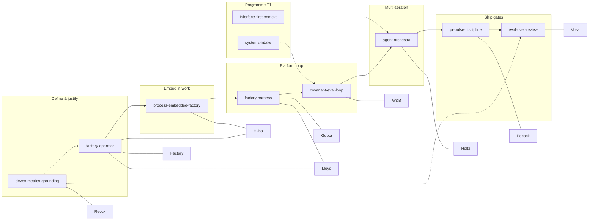

# Software factory skill / plugin package — implementable spec v1

**Status:** harmonized · **Spec version:** 1.0.0 · **Package version:** `plugin-manifest.json` → `1.1.0` (portable plugin) · **Corpus:** 9 ingested Paris 2026 talks (`research/ai-engineer-paris-2026/digest.json`) · **Package root:** `skills/paris-level-up/`

**Progress & distance traveled:** [`software-factory-skills-PROGRESS.md`](./software-factory-skills-PROGRESS.md) (timeline, coverage matrix, done vs pending).

### Version lineage

| Version | Commit (branch) | Summary |
|---------|-----------------|---------|
| — (skills only) | [`4db24e8`](https://github.com/manutej/wiring-and-the-whole/commit/4db24e8) | 8 Paris factory `SKILL.md` + `paris-level-up/README` curriculum |
| **v0 spec** | [`35b6c4c`](https://github.com/manutej/wiring-and-the-whole/commit/35b6c4c) | Spec v0, progressive disclosure (L1/L2/L3), consensus iterations 1–3, manifest stub |
| **v1 spec** | (this revision) | Cross-artifact consistency, spec rename v0→v1, progress report, registry/manifest alignment |

Supersedes [`software-factory-skill-plugin.v0.md`](./software-factory-skill-plugin.v0.md) (redirect stub only).

## Purpose

Ship a **Cursor-compatible skill bundle** (repo skills today; `plugin-manifest.json` stub) that encodes a coherent **software factory operating system** for long-running agents and team coding factories — with **progressive disclosure** so operators can act on Layer 1–2 while auditors drill to Layer 3 transcript cites and **on-demand L4/L5 references** for special areas without bloating agent context.

## Caption limitation (read once)

All ingested talks use **English (auto-generated) YouTube captions**. Timestamps and quoted snippets are **best-effort alignments** to those captions, not manual transcripts. Where digest/editorial bullets exist, prefer them over paraphrase. Claims not present in ingested JSON are **pending ingest** or **CONJECTURE** (editorial synthesis).

## Charter boundaries (read once)

| Lane | Scope | Must not |
|------|--------|----------|
| **Paris corpus + factory skills** | `research/ai-engineer-paris-2026/`, 8 skills under `skills/paris-level-up/`, registry rows | Change T1–T3 programme claims or witness frozen JSON without pulse |
| **Programme (T1)** | `interface-first-context`, `systems-intake`, `symmetry-lens` | Ship inside Paris plugin bundle; referenced at OS boundaries only |

Detail: [`docs/research/CORPUS-CHARTER.md`](../research/CORPUS-CHARTER.md) · operating model: [`docs/roadmap/CONSENSUS-FORWARD.md`](../roadmap/CONSENSUS-FORWARD.md).

## Package architecture

```text
skills/paris-level-up/
├── README.md                 # Install + curriculum (copy/submodule steps)
├── plugin-manifest.json      # v1: skills[]{id, path, triggers, referenceTierDefault, assetPaths}
└── assets/
    ├── factory-os-diagram.mmd
    ├── reference-tier-cheatsheet.md
    └── references-index.yaml   # slim L4 subset for satellite repos

skills/{factory-operator,…}/SKILL.md   # eight skills (siblings in monorepo)

research/ai-engineer-paris-2026/references/index.yaml   # L4 source of truth (monorepo)

Programme boundary (T1 — not in Paris bundle):
    interface-first-context/
    systems-intake/
    symmetry-lens/
```

### Portable plugin contract

| Artifact | Required | Notes |
|----------|----------|--------|
| `plugin-manifest.json` | Yes | `referenceIndex` → monorepo path; `referenceIndexPortable` → slim asset |
| `assets/` | Yes | Small diagrams/cheatsheets only — no transcripts, no `node_modules` |
| 8× `SKILL.md` | Yes | Lean body (~80 lines max); see below |
| `references/index.yaml` | Monorepo | Copy or symlink into target repo for L5 faithfulness |
| Programme skills | Optional | Boundary hooks only; not in manifest `skills[]` |

**Populate another repo:** copy `skills/paris-level-up/` + eight skill dirs; ship `assets/references-index.yaml` at minimum; sync full index + `transcript-summaries.json` when running evaluator-style audits.

### Install / discovery model (repo skills)

| Mode | Behavior |
|------|----------|
| **Repo skill** | Agent reads `SKILL.md` when `description` frontmatter matches user task (Cursor skill discovery). |
| **Curriculum** | Human or meta-agent loads `paris-level-up/README.md` order for greenfield factory design. |
| **Registry** | `docs/research-insights/paris-2026.yaml` maps `video_id` → skill path; CI via `make verify-research`. |
| **Reference index** | `research/ai-engineer-paris-2026/references/index.yaml` — L4 segments + L5 pointers; not loaded by default. |
| **Plugin stub** | `plugin-manifest.json` lists skill paths + trigger phrases + `referenceIndex` for packaged install. |

### Trigger model

Each skill `description` field holds **auto-apply phrases** (factory, harness, PR bottleneck, covariant eval, orchestra, DevEx, etc.). Plugin stub duplicates high-value triggers for marketplace packaging.

**Composition trigger:** user mentions “coding factory”, “long-running agents”, “software factory OS” → load `factory-operator` then follow README pipeline.

## Progressive disclosure schema

Every Paris factory skill MUST include a `## Progressive disclosure` section with:

### Reference disclosure tiers (L1–L5)

| Tier | Location | Default in agent context | Load rule |
|------|----------|--------------------------|-----------|
| **L1** | `SKILL.md` one-liner | Yes | Skill discovery / description match |
| **L2** | `SKILL.md` Layer 2 moves | Yes | Same |
| **L3** | `SKILL.md` **References** segment id list | Yes (ids only) | No long quotes in skill body |
| **L4** | [`references/index.yaml`](../../research/ai-engineer-paris-2026/references/index.yaml) `segments.<id>` | **No** | Load on audit / faithfulness pass |
| **L5** | `transcript-summaries.json#{video_id}` | **No** | Full-talk quotes; never copy into plugin folder |

**Lean skill limits (all 8 Paris skills):**

- YAML `description`: one crisp sentence + 3–5 trigger phrases.
- Body ~**80 lines** max: When to use / NOT, **5 core moves**, quality gate (5 bullets), failure modes (≤4 rows).
- **Layer 3** points to segment ids — not a duplicate quote table.
- **References** block: index path + L4 ids + L5 path pattern.

**Index schema (machine-readable):**

```yaml
segments:
  <segment_id>:
    video_id: <youtube_id> | null
    mmss: "MM:SS" | null
    label: FACT | CONJECTURE
    summary: one line
skills:
  <skill_id>:
    reference_tier_default: L3
    segments: [<segment_id>, ...]
```

CI: `scripts/verify_references_index.sh` (called from `make verify-research`) — index `video_id` ⊆ ingested; manifest skills ↔ index; each skill maps to ≥1 segment; each `SKILL.md` mentions its segment ids.

### Layer 1 — One-liner

Single sentence operable definition; no new claims beyond existing Core moves.

### Layer 2 — Moves

**5** bullet **moves** (mirror “Core moves”); imperative verbs; no transcript quotes. Label: **`Layer 2 moves:`**.

### Layer 3 — Reference ids

**Layer 3:** “Segment refs in **References**” — list L4 ids only; quotes live in `references/index.yaml` and L5 summaries.

### References (required section)

`## References` — index path, portable slim path, L4 segment ids, L5 `transcript-summaries.json#video_id` pattern.

### Unified system

Subsection **`## Unified system`** (or bold **Unified system** under progressive disclosure): **OS stage**, **upstream/downstream skills**, **primary talk(s)**. One talk minimum per skill; **dual-map** where one talk spans two skills by design (see matrix below).

## Unified factory OS (long-running agents)



### Talk coverage matrix (9 ingested)

Each `video_id` in `digest.json` → `transcripts_ingested` appears in **exactly one primary skill** row; **dual-map** rows add a secondary skill for split themes.

| video_id | Speaker | Primary skill | Dual-map (secondary) | Role in OS |
|----------|---------|---------------|----------------------|------------|
| `HvboD89DyQ8` | Cooke, WorkOS | process-embedded-factory | factory-operator | Embed + skeptic metrics |
| `vGCJ7diEtrw` | Tížková, Factory | factory-operator | — | Builder economics / build-buy |
| `tUPPVhBBcoM` | Lloyd, Warp | factory-harness | factory-operator (L3 cite) | Environment-centric factory |
| `TN3mj92oZ8I` | Gupta, Warp | factory-harness | — | Harness + refresh + routing |
| `XyV6bSMyq-I` | Aysola, W&B | covariant-eval-loop | — | Covariant eval flywheel |
| `TRfzFJCJ7ZE` | Holtz, Conductor | agent-orchestra | — | Parallel coordination |
| `LlgiOCmFG_w` | Pocock, AIHero | pr-pulse-discipline | — | PR/pulse brakes |
| `_mi3alkqy4s` | Voss, Arize | eval-over-review | — | Eval over ritual review |
| `Se8jHLliLXE` | Reock, DX | devex-metrics-grounding | — | Org measurement |

## Multi-agent consensus (this spec)

Three iterations documented under [`software-factory-skills-consensus/`](./software-factory-skills-consensus/). Roles:

1. **Advocate** — proposes unified OS + skill sections.
2. **Faithfulness evaluator** — reads **only** `digest.json`, `transcript-summaries.json`, `catalog.json` (no advocate prose); scorecard per talk/skill.
3. **Operator synthesizer** — merges evaluator deltas into next iteration.

Final skill content is iteration-3 output; v1 spec adds harmonization + progress narrative only (no core-move rewrites).

## Implementation phases

| Phase | Deliverable | Acceptance | Status |
|-------|-------------|------------|--------|
| **P0** | Spec + consensus artifacts | 3 iterations on disk | **Done** |
| **P1** | 8 `SKILL.md` + README progressive disclosure | Layer 1–3 + Unified system | **Done** |
| **P2** | `plugin-manifest.json` | Rich `skills[]` + assets + referenceIndex | **Done** (v1.1.0 portable) |
| **P3** | Registry row for spec | `paris-2026.yaml` target | **Done** |
| **P4** | CI | `make verify` + `make verify-research` PASS | **Done** on branch |
| **P5** | Reference index L4/L5 + verify hook | `references/index.yaml`; `make verify-research` index ⊆ ingest | **Done** (index v1) |
| **P6** | Optional enrichments | See PROGRESS § Pending | **Partial** |

## Acceptance tests — faithfulness

Automatable / manual checks for reviewers:

1. **Coverage:** Every ingested `video_id` appears in ≥1 L4 segment in `references/index.yaml`.
2. **No orphan skills:** Each skill maps to ≥1 segment; manifest ids match index `skills` keys.
3. **FACT audit:** Spot-check L4 FACT summaries against `transcript-summaries.json` or digest bullets.
4. **CONJECTURE hygiene:** Editorial segments (e.g. `holtz-orchestra-thesis`) labeled CONJECTURE in index.
5. **Caption banner:** README or spec states auto-caption limitation once (this doc § Caption limitation).
6. **Pending ingest:** Catalog videos not in `transcripts_ingested` must not appear as FACT (e.g. Antigravity `buHC7bQE1X4` = pending).
7. **Research gate:** `make verify-research` passes on branch (includes reference index ⊆ `transcripts_ingested`).
8. **Version alignment:** `plugin-manifest.json` `version` + this doc title + registry spec `target` path all reference **v1**.
9. **Reference hygiene:** Each Paris skill References subsection cites valid L4 ids present in `references/index.yaml` for its primary talk(s).

## Pulse alignment

Factory pulses should use [`docs/pulse/IMPLEMENTER-BRIEF-TEMPLATE.md`](../pulse/IMPLEMENTER-BRIEF-TEMPLATE.md): small PR, firewalled evaluator, `make verify-research` when Paris JSON or skills change.

## References

- **Progress report:** [`software-factory-skills-PROGRESS.md`](./software-factory-skills-PROGRESS.md)
- Corpus charter: [`docs/research/CORPUS-CHARTER.md`](../research/CORPUS-CHARTER.md)
- Registry: [`docs/research-insights/paris-2026.yaml`](../research-insights/paris-2026.yaml)
- Pulse: [`docs/PULSE.md`](../PULSE.md)
- PR: [GitHub #4](https://github.com/manutej/wiring-and-the-whole/pull/4) (`cursor/ai-engineer-paris-research-8e4f`)
