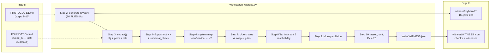
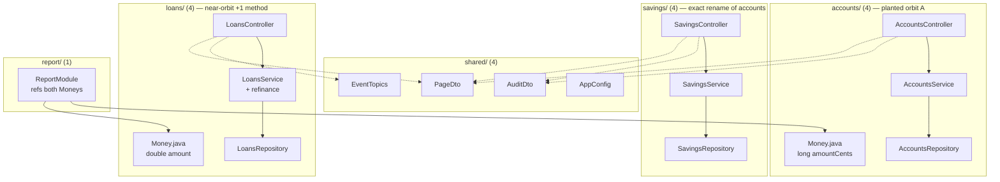
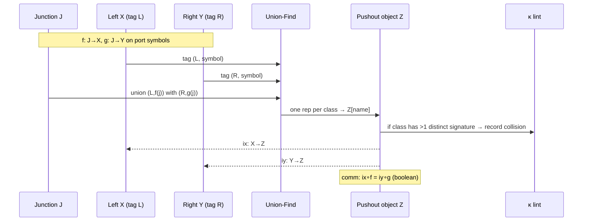
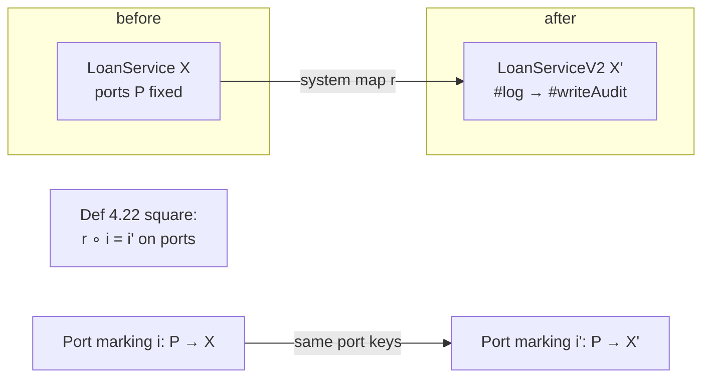
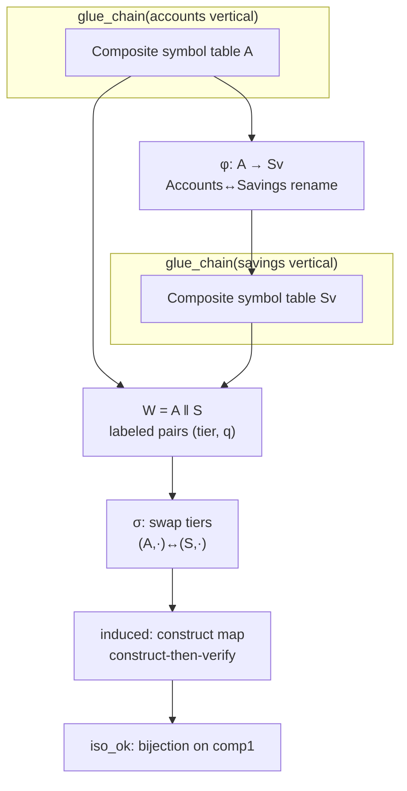
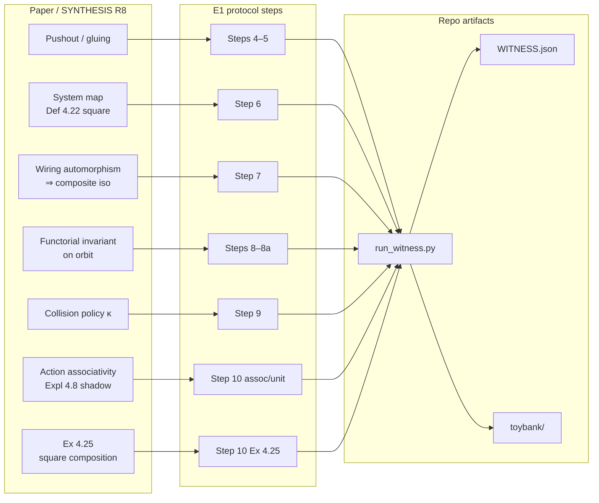

# E1 witness — how it works

**Artifact of record:** `witness/WITNESS.json` · **Protocol:** [`experiments/PROTOCOL-E1.md`](../../experiments/PROTOCOL-E1.md) · **Runner:** `witness/run_witness.py` · **Status:** 13/13 checks (`all_pass: true` as of last run).

---

## Executive summary

The E1 **R8 faithfulness witness** is a single Python script that turns a 16-file toy Java-shaped repo into evidence that the phrase “codebase = module of systems” can be *demonstrated*, not merely asserted. It instantiates a witness-scale category **C₀ (SymTab)**, advertised as the skeleton of the committed **Code_X** from `FOUNDATION.md` (not in this repo): objects are finite typed symbol tables; morphisms preserve kind and signature; pushouts are set-level amalgamation along port identifications; **κ** is a lint predicate that fires when incompatible signatures are identified in a quotient.

The runner is monolithic by design: it **generates** `witness/toybank/`, **extracts** each file into a C₀ object plus port marking and ref edges, then runs the protocol steps 4–10 as boolean checks with serialized witnesses in JSON. Success means every check passes—including a deliberate **Money** collision where κ must fire and four clean gluings where κ must stay silent. The witness does **not** prove Code_X in general, linker semantics, or repo-scale behavior; caveats in `HANDOFF.md` and `README.md` travel with every citation.

At toy scale the script exhibits one real pushout (LoanService ⊔ LoanRepository with distinct internal `#log` symbols), a system-map square (LoanService → LoanServiceV2), a wiring automorphism swap(accounts, savings) with a construct-then-verify composite isomorphism, a named port-reachability invariant **B** constant on the planted exact orbit, paper-style associativity and monoidal-unit checks, and a non-vacuous Ex 4.25 naturality square after panel repair. Two protocol deviations are recorded in code: universal-property checking is **bounded** rather than exhaustive at `|Q| ≤ |Z|+2`, and extraction uses regex over Java-flavored text rather than a full AST pipeline.

---

## CODE-C tuple: C₀ vs Code_X

| Layer | Role in this repo |
|--------|-------------------|
| **Code_X** (committed, `FOUNDATION.md` lost) | Target category: copresheaves on a finite typed-symbol schema; pushouts always exist; κ diagnoses collisions on the quotient map. |
| **C₀ SymTab** (what E1 runs) | Skeleton used in `run_witness.py`: qualified names → `(kind, signature)`; ports = exported symbols; `pushout()` unions tagged copies; κ lists signature clashes. |
| **CODE-C = (C, M, P, κ)** | Parametric 4-tuple from PROTOCOL-E1; here **C = C₀**, **M** = kind+signature-preserving maps, **P** = port subsets per unit, **κ** = collision lint on pushout output. |

The tuple is recorded verbatim at the top of `WITNESS.json` under `code_c`.

---

## Overall witness pipeline



**Data kinds flowing through extraction (step 3):**

- **Object** `obj`: map `qualified_name → (kind, signature)` e.g. `loans.LoansService#fetchPage → (method, Page(int))`.
- **Ports** `ports`: subset of `obj` where members are `public`.
- **Refs** `refs`: tokens from `// refs:` comments (wiring diagram **W** at toy granularity).

Implementation lives in `extract()` and the inline `FILES` / `vertical()` templates in `witness/run_witness.py`.

---

## Toybank module graph and file roles



| Path | Role in witness |
|------|------------------|
| `accounts/*`, `savings/*` | Vertical MVC triples; **accounts ≡ savings** up to namespace rename (step 7 orbit). |
| `loans/*` | **Real pushout** site (Service ⊔ Repository, step 5); **associativity** chain (step 10); extra `refinance` method (near-orbit, not folded). |
| `accounts/Money.java`, `loans/Money.java` | **Signature-incompatible** collision pair (step 9). |
| `report/ReportModule.java` | Imports both Money field refs; drives deliberate bad glue. |
| `shared/*` | DTOs and config; **monoidal unit** pair `PageDto` + `AppConfig` (empty junction glue). |

Files on disk under `witness/toybank/` are regenerated on every run (deterministic templates).

---

## Pushout and κ (steps 4–5, 9)



**Step 5 (the real pushout):** glue `loans/LoansService.java` with `loans/LoansRepository.java` along repository **ports**. Both bodies define private `log`; qualified names `loans.LoansService#log` and `loans.LoansRepository#log` must **not** merge. Success: `step5_fresh_names_inside_C` requires two distinct `#log` entries in `Z5`.

**Step 9 (collision):** synthetic junction identifies `accounts.Money#amountCents` with `loans.Money#amount`; κ must fire (`step9_kappa_fires_on_collision`).

Core code: `pushout()`, `UF`, and step 5/9 call sites in `witness/run_witness.py`.

---

## System map square (step 6)



Checks: `step6_system_map_square` (morphism + ports align) and `step6_ports_preserved` (exported port keys unchanged under `rmap`).

---

## Wiring automorphism → composite iso (step 7)



`phi` is a kind+signature-preserving bijection; the witness does **not** search for an isomorphism—it builds `induced` from σ and φ and verifies inverse laws on the finite composite.

---

## Invariant B (steps 8, 8a)

**Definition (file-granular):** `B` = set of directed edges `(port_a, port_b)` where `port_a` is exported in some unit and `port_b` appears in that unit’s `refs` list and is also an exported port somewhere in the vertical.

- `step8_invariant_constant_on_orbit`: transport `BA` along φ equals `BS`.
- `step8a_system_maps_preserve_invariant`: renaming internal `#log` on accounts vertical leaves `BA` unchanged (ports fixed).

This discharges the “non-vacuous functorial invariant” half of GA3 at witness scale.

---

## Paper constructs ↔ witness steps ↔ artifacts



---

## The 13 checks (mapping table)

| Check key | Protocol step | What it proves | Implementation (file / region) | Typical failure modes |
|-----------|---------------|----------------|--------------------------------|------------------------|
| `step4_pushout_commutes` | 4 | Pushout diagram commutes: `ix∘f = iy∘g` on junction. | `pushout()` comm flag; step 5 call ~L146 | Wrong junction maps; union-find tagging bug; comm not checked. |
| `step4_universal_property_bounded` | 4 | Mediating morphisms exist for a **bounded** cocone family (recorded deviation from full `\|Q\| ≤ \|Z\|+2` enumeration). | `universal_check()` ~L118–132; step 5 ~L149 | False pass if cocone family too small; need Code_X-scale exhaustive check. |
| `step5_fresh_names_inside_C` | 5 | Internal `log` symbols stay distinct after Service⊔Repository glue (no extra-categorical freshening). | Step 5 ~L147–148 | Treating unqualified names as global; merging `#log` across units. |
| `step5_no_false_kappa` | 5, 9 contrast | Clean Loan pushout: κ empty (no false collision). | Step 5 ~L153 | Over-aggressive κ; mis-tagged signatures in quotient. |
| `step6_system_map_square` | 6 | Refactor `LoanService→V2` is a C-morphism and port markings agree (Def 4.22). | Step 6 ~L157–165 | Port signature drift; non-preserving rename on exported API. |
| `step6_ports_preserved` | 6, 10 | Exported port **keys** fixed under system map (also used in Ex 4.25 lift). | Same `ports_ok` ~L164, ~L290 | Accidental rename of public method names. |
| `step7_automorphism_composite_iso` | 7 | swap(accounts,savings) induces isomorphism on glued composite (construct-then-verify). | Step 7 ~L168–203 | Wrong φ on near-orbit loans; isomorphism search instead of prescribed σ. |
| `step8_invariant_constant_on_orbit` | 8 | Reachability invariant **B** agrees on planted exact orbit after transport. | `reach()` ~L205–218 | Wrong ref parsing; orbit includes near-iso loans incorrectly. |
| `step8a_system_maps_preserve_invariant` | 8(a) | System map from step 6 (accounts-side rename) preserves **B**. | ~L287–289 | Invariant defined on wrong granularity; ports not fixed. |
| `step9_kappa_fires_on_collision` | 9 | κ fires on incompatible Money identification; documents silent-merge branch. | Step 9 ~L223–231 | κ too weak (GA1 presheaf silent merge); false negative. |
| `step10_associativity_canonical_iso` | 10 | `(A⊔B)⊔C` vs `A⊔(B⊔C)` same canonical object on loans MVC chain. | `glue2()` ~L235–251 | Previously degenerate comparison (v1 bug); wrong junction on chain. |
| `step10_monoidal_unit_disjoint_union` | 10 | Empty junction glue = disjoint union (monoidal unit). | ~L254–257 | Non-empty J on unit test; symbols incorrectly merged. |
| `step10_ex425_squares_compose` | 10 | Ex 4.25: lift commutes with swap σ (naturality), nontrivial lift, ports fixed. | ~L258–286 | Vacuous lift (panel caught in v3); naturality without φ transport on savings. |

---

## How to run

From repo root (Python 3.11+ stdlib only; no pip):

```bash
python3 witness/run_witness.py
```

Expected stdout ends with `"all_pass": true` and 13 `"checks"` entries all `true`. The script **rewrites** `witness/toybank/**` and `witness/WITNESS.json`.

For the full pre-registered procedure, success criteria, and decision rules (halt equivariance language on step 7 fail, CODE-C revision on step 5 fail, etc.), see **[`experiments/PROTOCOL-E1.md`](../../experiments/PROTOCOL-E1.md)**.

**Interactive diagrams:** [`diagrams.html`](diagrams.html) (same Mermaid figures, browser-rendered).

---

## Implementation map (quick reference)

| Concern | Location |
|---------|----------|
| Toybank templates | `FILES`, `vertical()` — start of `run_witness.py` |
| Extraction | `extract()`, `MEMBER` regex |
| Category ops | `is_morphism`, `pushout`, `UF`, `universal_check` |
| Gluing chains | `glue_chain`, `glue2`, `as_unit` |
| Report emission | bottom of `run_witness.py` → `WITNESS.json` |

---

## What this does *not* claim

See `README.md` claims discipline: not rex-ness of Code-C in general; not ⟦−⟧ to real linkers; not approximate orbits (GA2); not MUST-PROVE 1–5. Universal property and extraction fidelity are explicitly bounded / regex-level until C₀ → Code_X upgrade.
