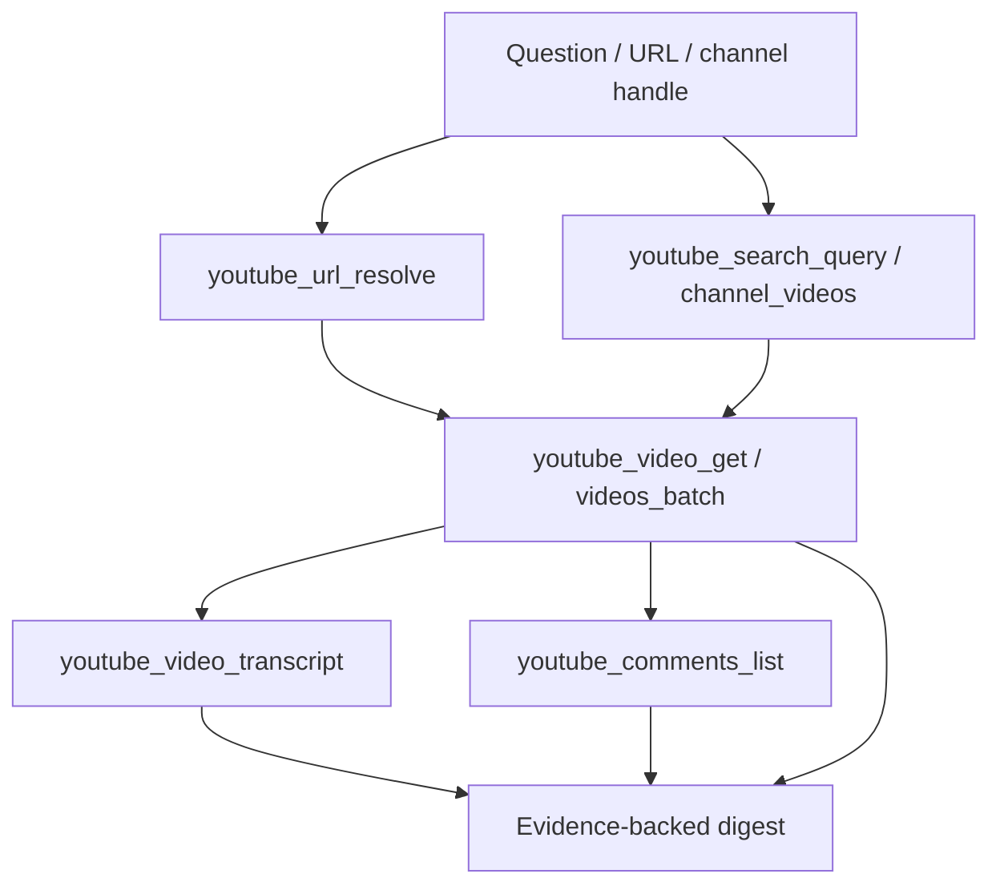
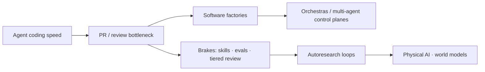

# Visual reference — TubeAlfred & Paris 2026 learnings

Interactive canvas: open **TubeAlfred + Paris 2026 — Visual Map** in Cursor (canvas id `6e28b13a-af45-4321-a5f0-7a94bc314e11`).

## TubeAlfred read pipeline

## What each layer gives you

| Layer | Source tools | You get | You do **not** get |
|-------|----------------|---------|---------------------|
| Identity | `url_resolve`, `channel_get` | IDs, handles, canonical URLs | Private channel analytics |
| Discovery | `search_query`, `channel_videos` | Ranked public results (snapshot) | Stable SEO rank truth |
| Metadata | `video_get`, `batch` | Title, description, duration, public counts | Retention, CTR, revenue |
| Speech | `video_transcript` | Timestamped segments, caption kind | Speaker diarization guarantees |
| Audience | `comments_list` | Public comment text + engagement | Representative sentiment |

## Paris 2026 — conceptual story (from ingest)

## Evidence discipline

- **Metadata** = schedule lineups, view counts, publish times (TubeAlfred snapshot).
- **Transcript** = speaker claims; cite timestamps when quoting.
- **Comments** = sampled public reactions; never “all viewers think…”
- **Inference** = theme clustering and narrative arrows in diagrams — labeled as synthesis.
