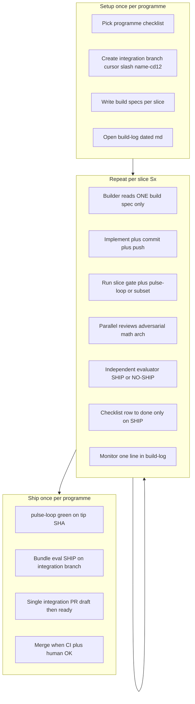
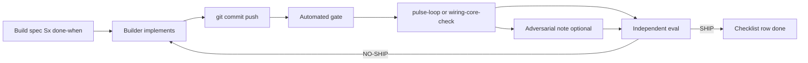
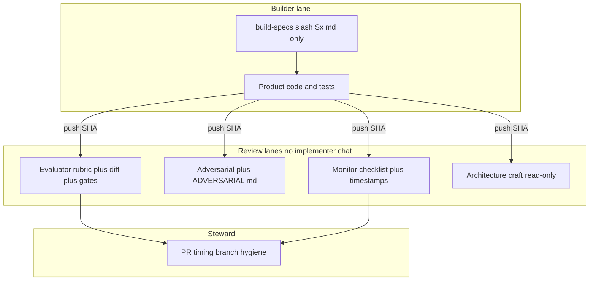
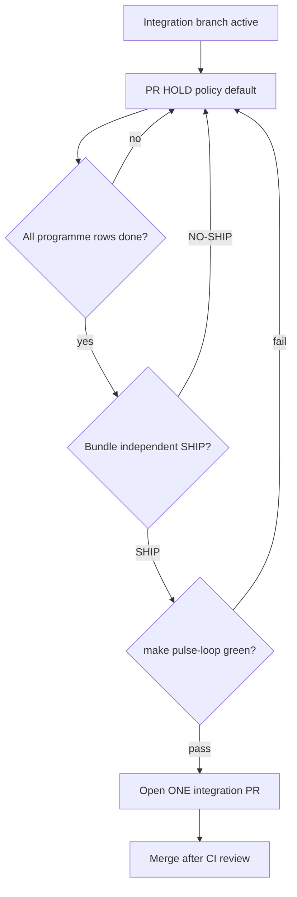
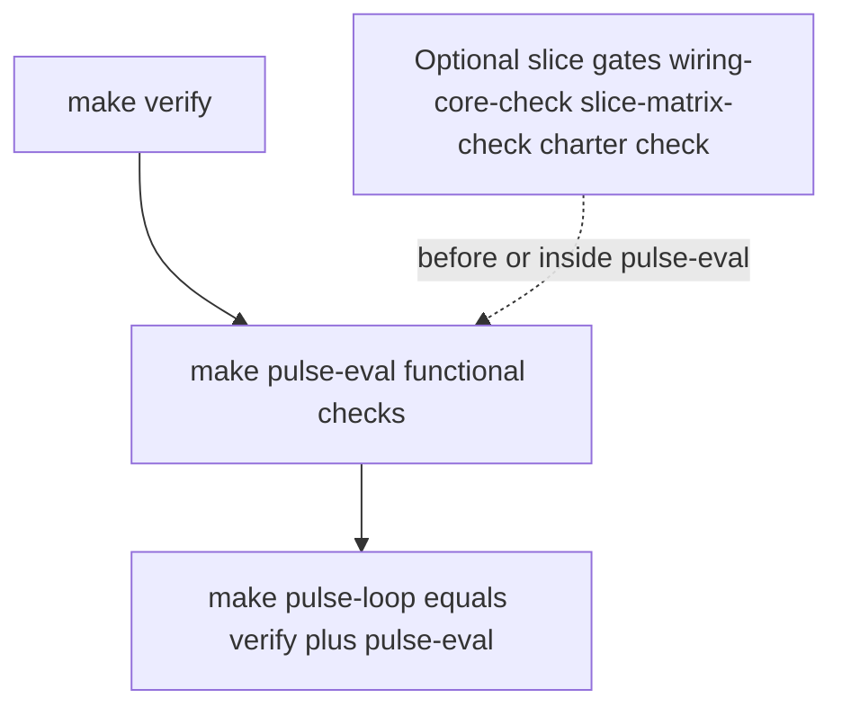

# Compound build loop

**Purpose:** Run a **large programme** as many **small, gated slices** on one **integration branch**, with **role-separated** agents and **one integration PR** only when the programme checklist is green and an independent evaluator has **SHIP**ped the bundle.

**Canonical instance in this repo:** [`docs/operations/COMPOUND-BUILD-SOP.md`](../../docs/operations/COMPOUND-BUILD-SOP.md), checklists [`MVP-CHECKLIST.md`](../../docs/operations/MVP-CHECKLIST.md) / [`SCALE-BUILD-2-CHECKLIST.md`](../../docs/operations/SCALE-BUILD-2-CHECKLIST.md), gates `make pulse-loop`.

---

## When to use

- Tiered roadmap (M0 → M1 → M2 …) or “large build; PR only at the end”.
- Engine cutover (e.g. Python → Rust) where **parity gates** must block drift.
- Any work where **implementers must not self-SHIP** ([`AGENTS.md`](../../AGENTS.md)).
- Cursor Cloud / multi-subagent runs with **builder / eval / adversarial / monitor** lanes.

## When NOT to use

- Single-file fix or doc typo → normal commit + small PR.
- Research-only lanes (Paris/Every) that must not touch product gates.
- Urgent hotfix to `main` without programme checklist (use explicit exception in build-log).

---

## Programme DAG (end-to-end)



---

## Per-slice compound loop (one checklist row)



**Rule:** The builder **never** marks a row **done** from self-review. Only **independent SHIP** + green gate.

---

## Role firewall DAG (who may know what)



| Role | Reads | Must NOT | Writes |
|------|--------|----------|--------|
| **Builder** | `build-specs/<slice>.md` | Eval rubric, adversarial playbook, other agents’ threads | Code, commits on integration branch |
| **Independent evaluator** | Diff, gates, build spec done-criteria | Implementer conversation | `docs/pulse/evaluations/*-independent.md` → **SHIP \| NO-SHIP** |
| **Adversarial** | Eval inputs + `plans/ADVERSARIAL.md` | Fix code (unless explicitly tasked) | `docs/pulse/adversarial/*-independent.md` |
| **Monitoring** | Checklist + gate output | Product code | `docs/operations/build-log/*.md` rows |
| **Math / limits** | Frozen JSON, token reports | Implementation | `build-log/*-math.md` |
| **Senior architecture** | Architecture docs | Slice pass/fail authority | `build-log/*-arch.md` recommendations |
| **PR steward** | Branch vs checklist | Open PR before programme gate | Build-log note; **one PR** when allowed |

---

## PR timing DAG (when to open GitHub/GitLab PR)



**Default:** `PR: **hold**` on checklist until bundle SHIP + pulse green. User may request **“large step then PR”** — same gate, no interim PRs per slice.

---

## Gate stack DAG (verification order)



**Before every merge to `main`:** `make verify` + `make pulse-loop` on integration branch tip.

**Slice-specific gates** belong in build spec **done-when** (e.g. parity script, world I/O pipeline, matrix runner).

---

## Operating procedure (host / lead agent)

### 0. Programme charter

1. Create **`docs/operations/<PROGRAMME>-CHECKLIST.md`** — table: ID, item, gate command, status.
2. Set **`PR: hold`** until programme complete.
3. Create integration branch: `cursor/<programme>-cd12` off current `main`.
4. Start **`docs/operations/build-log/YYYY-MM-DD-<programme>.md`**.

### 1. For each slice `Sx`

1. Write **`docs/operations/build-specs/Sx-<slug>.md`** with **done-when** bullets (testable, no prose essays).
2. **Builder** subagent: spec only → implement → **`git commit`** → **`git push -u origin <branch>`**.
3. Run gates listed in spec + ensure **`make pulse-loop`** still passes (or note partial gate if slice is docs-only).
4. **Parallel** (separate subagents, no builder context): adversarial, math, arch as needed.
5. **Independent evaluator** subagent: run gates on SHA → **`docs/pulse/evaluations/YYYY-MM-DD-<slice>-independent.md`**.
6. On **SHIP:** set checklist row **done (eval SHIP)**; monitor appends one build-log row.
7. On **NO-SHIP:** builder fixes → new commit → re-eval (do not mark done).

### 2. Programme completion

1. All checklist rows **done**.
2. Bundle eval **`…-<programme>-independent.md`** → **SHIP**.
3. `make pulse-loop` on tip.
4. PR steward: **one** integration PR (draft → ready → merge).
5. Update checklist **PR: merged** with link.

### 3. Craft (review-time, not new CI layers)

Apply [manutej/craft](https://github.com/manutej/craft): **effects-and-purity**, **trustworthy-tests**, **robustness-at-boundaries**, **right-sized-design**.

---

## Artifact templates

### Programme checklist (minimal)

```markdown
# <Programme> checklist

| ID | Item | Gate | Status |
|----|------|------|--------|
| S0 | … | `make verify` | pending |
| S× | … | `make …` | pending |
| **PR** | Single integration PR | All S× + eval | **hold** |

Build log: [`build-log/YYYY-MM-DD-<programme>.md`](build-log/…)
```

### Build spec (builder-facing)

```markdown
# Build spec Sx — <title>

**Done when:**
1. …
2. …
3. Gate: `…`
```

### Build-log row

```markdown
| UTC | Phase | Actor | Result |
| 2026-… | Sx | builder | `<sha>` — one line outcome |
| 2026-… | Sx eval | independent | SHIP / NO-SHIP — link to eval doc |
```

### Evaluator output (required fields)

- **Verdict:** SHIP | NO-SHIP (scope: slice or bundle)
- **SHA / branch reviewed**
- **Commands run** (copy-paste reproducible)
- **Done-when table** vs build spec
- **Conditions** (if conditional SHIP)

---

## Porting to another repository

1. Copy **`skills/compound-build-loop/`** (this skill) into target repo `skills/`.
2. Add **`docs/operations/`** with checklist, `build-specs/`, `build-log/`.
3. Point **gates** column at that repo’s real targets (`make test`, `npm test`, etc.) — keep the **same DAG**; only leaf commands change.
4. Add **`AGENTS.md`** rule: implementer self-SHIP void; independent eval required before merge.
5. Name integration branches **`cursor/<slug>-<env-suffix>`** if using Cloud Agent conventions.

---

## Example programmes (this repo)

| Programme | Checklist | Integration branch | Merge |
|-----------|-----------|-------------------|--------|
| MVP M1+M2 | [`MVP-CHECKLIST.md`](../../docs/operations/MVP-CHECKLIST.md) | `cursor/mvp-engine-push-cd12` | [#42](https://github.com/manutej/wiring-and-the-whole/pull/42) merged |
| Scale S2 | [`SCALE-BUILD-2-CHECKLIST.md`](../../docs/operations/SCALE-BUILD-2-CHECKLIST.md) | `cursor/scale-build-2-cd12` | PR **hold** until S2× SHIP |

---

## Subagent prompts (sketch)

**Builder:** “Implement only `docs/operations/build-specs/Sx-….md`. Branch `cursor/…`. Commit push. Do not read eval rubric or write SHIP.”

**Independent eval:** “Review SHA on branch. Run gates in spec. Write `docs/pulse/evaluations/…-independent.md`. Do not change code unless NO-SHIP blocker.”

**Monitor:** “Poll checklist + gates; append one row to build-log; do not edit product code.”

---

## Quick reference commands (wiring-and-the-whole)

```bash
make verify
make pulse-loop
make wiring-core-check      # Rust/Python engine parity
make pipeline-io            # WIRING_ENGINE=rust default
make slice-matrix-check     # multi-slice shard runner
make charter-1k-check       # scale-honest external slice
```

Adjust commands when porting; keep **verify → pulse-eval → pulse-loop** ordering in the gate DAG.
